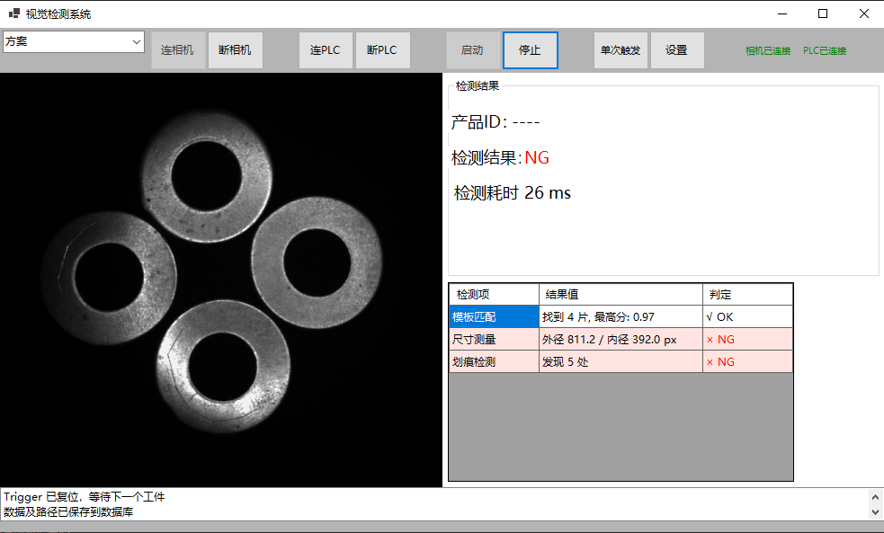

## 项目截图

    
# 基于机器视觉的垫圈外观在线检测系统

本项目是一套面向工业产线的垫圈外观自动检测上位机软件。通过集成西门子 PLC 通信、海康工业相机采集与 Halcon 机器视觉算法，实现了“PLC 触发 → 图像采集 → 视觉检测 → 结果回写 → 数据入库”的全自动闭环流程，有效替代人工目检，提升生产效率。

## 核心功能

*   **工业通信与控制**：基于 S7.Net 与西门子 S7-1500 PLC 实现稳定握手通信，支持触发信号检测、检测结果与错误码实时回写，以及断线自动重连机制。
*   **机器视觉算法**：集成 Halcon 算法，实现工件模板匹配定位、内外径尺寸测量（Blob 分析）及表面划痕缺陷检测（动态阈值）。
*   **多线程架构**：采用“相机取流 + PLC 轮询 + 检测任务”并行模式，通过 `async/await` 与线程锁保障 UI 响应流畅与数据安全。
*   **数据追溯**：自动将检测记录（含时间、产品ID、结果及图片路径）存入 SQL Server 数据库，支持历史数据查询。

## 技术栈

*   **开发语言**：C# / .NET Framework 4.7+ (WinForm)
*   **视觉库**：Halcon 18.11+
*   **通信/硬件**：S7.Net (西门子 S7协议)、海康威视工业相机 SDK (MvCameraControl)
*   **数据库**：SQL Server

## 快速开始

### 环境要求

*   Visual Studio 2019+
*   Halcon 18.11+ (需拥有运行时授权)
*   SQL Server (本地安装即可)
*   海康威视 MVS 运行时库

### 运行步骤

1.  **克隆项目**
    
